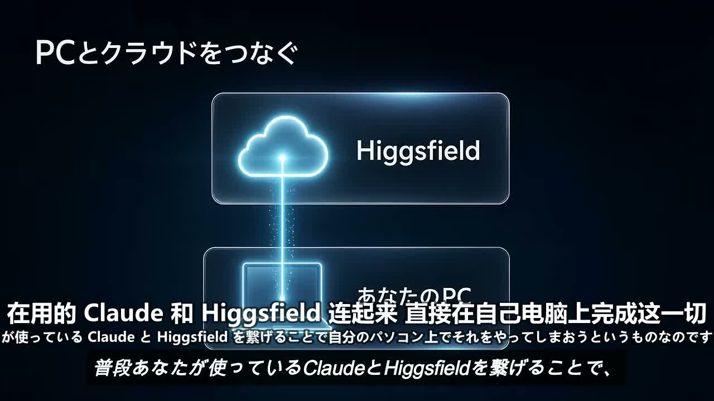

<div align="center">

# 🎬 video-skills



<sub>▲ 一句「翻译这个视频」跑完的真实成片：中文大字在上、原文小字在下</sub>

> *「给 Claude 一双眼睛，再给它一支译笔。」*

**粘一个 YouTube / B站链接，Claude 就能回答"这视频到底讲了啥"；再补一句"翻译它"，外语视频当场变成带中文字幕的成片 + 可读的文稿——全程本地，转录不花一分钱 API 费。**

<sub>两个 Claude Code / Agent Skills 技能，共享一套下载·转录底座 · Windows / macOS / Linux 开箱即用</sub>

[](LICENSE)


[看效果](#-效果示例) · [装它](#-装它一行命令) · [两个技能](#-两个技能各管一件事) · [支持哪些视频](#-支持哪些视频) · [关于作者](#-关于作者)

</div>

---

## 🔥 效果示例

**先看它能干什么，再决定要不要装。**

### 场景一：让 Claude「看」一个视频

```
你：  /watch https://youtu.be/xxxx 这个新功能到底解决了什么问题？

Claude：（yt-dlp 下载 → ffmpeg 场景感知抽帧 → 拿到带时间戳的转录 → 逐帧看完）
        这条视频在讲 Higgsfield MCP 怎么接进 Claude。
        02:14 的画面里能看到「MCP & CLI」入口，05:32 演示了加连接器的三步，
        核心结论是：API 本该按企业价计费，走 MCP 后能在日常订阅额度里用掉。
```

**它是真的"看见"了画面——不是猜字幕，而是把每一帧当图片读进去，能引用具体时间戳。**

### 场景二：把外语视频翻译成中文字幕成片

```
你：  /video-translate https://youtu.be/xxxx

Claude：选择字幕类型？ ▸ 中文  /  中日双语
        （下载 → faster-whisper 词级转写 → 逐条润色翻译 → 烧录 → 截 4 帧自检）

        ✅ Claudeで動画生成する方法-中日双语字幕.mp4   （92 MB，16 分钟全片）
        ✅ …-原文.md   （日语转写整理）
        ✅ …-中文.md   （中文深度文章体，非逐句直译）
```

**词级时间戳保证字幕不抢跑、不挤条，说完正好换条；双语用真正的 ASS 做出「中大原小」反差——而不是把两行字平铺。**

---

## 📦 装它（一行命令）

```bash
git clone https://github.com/shushuitie2017/claude-video.git
cd claude-video
python install.py          # 复制两个技能到 ~/.claude/skills/ + 脚手架配置 + 依赖自检
```

或作为 Claude Code 插件：

```
/plugin marketplace add shushuitie2017/claude-video
```

<details>
<summary>外部工具（install.py 会检查并给出你平台的确切命令）</summary>

```bash
# Windows
winget install Gyan.FFmpeg ; winget install yt-dlp.yt-dlp
# macOS
brew install ffmpeg yt-dlp
# Linux
sudo apt install ffmpeg fonts-noto-cjk ; pipx install yt-dlp

# 推荐：免费本地转录引擎（翻译管线必备其一，没有它就退到 API）
pip install faster-whisper
```

**不配任何 API key 也能用**：有字幕的视频全免费；无字幕的靠本地 faster-whisper（也免费）。
</details>

---

## 🎯 两个技能，各管一件事

| 技能 | 触发 | 它做什么 | 产出 |
|------|------|----------|------|
| **/watch** 👀 | 贴视频链接提问 / "这视频讲了什么" | 抽帧 + 转录，让 Claude 真看见画面回答问题 | 带时间戳引用的分析回答 |
| **/video-translate** ✍️ | "翻译视频" / "配字幕" / "出文稿" | 转写→润色→烧字幕→出文章 | 烧好字幕的 mp4 + 双 Markdown 文稿 |

两者共享一套底座：**yt-dlp 下载**（浏览器 cookies 自动兜底，治 YouTube 风控与 B站登录墙）+ **三级转录**（原生字幕 → 本地 faster-whisper → Groq/OpenAI API，能免费就免费）。

## ✨ 特性

| | |
|---|---|
| 🧠 **智能抽帧** | 场景感知选帧 + 按时长预算 + 感知去重（静止画面不浪费 token），四档拨盘 `transcript / efficient / balanced / token-burner` |
| ⏱️ **词级时间戳字幕** | 本地 faster-whisper 词级转写，按「句子+停顿」断句——字幕不抢跑、不挤半句 |
| 💬 **人类级润色** | ASR 纠错、去口头语、断句 ≤12 字、专有名词保留原文、静音检测裁掉超长挂屏 |
| 🀄 **双语字幕** | 中大原小 1.7:1 实测反差，真 ASS 烧录（SRT 内联字号会被 ffmpeg 剥离——这坑踩过） |
| 💧 **间歇水印**（可选） | 按视频时长自动排布出现次数，0.5s 渐隐渐出 |
| 🪟 **Windows 一等公民** | WinGet 路径自动探测、微软雅黑字体链、filter 路径转义全在脚本内搞定；mac/Linux 同样开箱即用 |
| 🧩 **零 pip 强依赖** | 核心纯 stdlib，faster-whisper 只是可选增强 |

## 🌐 支持哪些视频

YouTube、Bilibili、X / Twitter、TikTok、Vimeo、Twitch 剪辑等 **yt-dlp 支持的数百个站点**，以及本地文件（mp4 / mkv / webm / mov…）。被风控时自动读浏览器 cookies 重试（默认 Chrome，可换 `--browser firefox/edge`）。

## ⚙️ 工作原理（翻译管线）

1. **下载**：yt-dlp 取完整视频（合并音视频轨），失败自动上 cookies 兜底。
2. **转写**：ffmpeg 提音频 → faster-whisper 出**词级**时间戳，按句子+停顿切成字幕条。
3. **润色**：Claude 本人逐条翻译（这是 LLM 的活，没有脚本能替）——纠错、去冗余、断句、术语保留。
4. **烧录**：`burn.py` 组装 ffmpeg 命令（路径转义 / 强制 AAC / 双语转 ASS / 水印排布），一次编码完成，`--dry-run` 可先审。

## 🚧 诚实边界

一个不告诉你局限的工具不值得信任，所以：

- **最佳体验是 10 分钟内的视频**；更长的建议 `--start/--end` 聚焦片段，或分段处理。
- **直播流不支持**，得等视频完结。
- **需登录 / 地区锁 / 付费的内容**，cookies 兜底也救不了的，就是救不了——它会直说，不会假装成功。
- **翻译质量取决于当前对话里的模型**——这套技能负责把下载、转录、断句、时间轴、烧录做到位，把"信达雅"留给 Claude。

## 💡 背后的故事

Claude 很聪明，但它有个盲区：**看不了视频**。你贴一个 YouTube 链接，它只能干瞪眼。

市面上的工具要么只能「下载」，要么只能「转字幕」，要么只能「翻译」——没有一套把「让 Claude 看懂」和「产出中文成片」这两件事连起来。于是有了 video-skills：**一个负责回答问题（/watch），一个负责产出成片（/video-translate），共享一套下载转录底座**。名字很直白，就是"给视频这件事的一组技能"——不玄乎，好记就行。

它在一支 16 分钟的日语教程上跑通了全链路：词级转写 167 条、中日双语烧录、截 4 帧自检无遮挡无方块。**每一个 Windows 上的坑（管道 GBK、WinGet 路径、字体缺字形）都是真机踩出来再堵上的。**

## 👤 关于作者

我是 **蓝猫 · BlueCat**，一个 AI-native builder，做工具、做 3D、做站点，也把好玩的东西开源。

| | |
|---|---|
| 🐙 GitHub | [@shushuitie2017](https://github.com/shushuitie2017) |
| 💬 微信 | 扫码加我，聊聊工具 / AI / 想法 👇 |


### 🧰 也在做

顺手安利几个同样开源 / 在线可玩的项目：

| 项目 | 一句话 | 在线 |
|------|--------|------|
| 🧪 **HardwareLab** | 3D 程序化建模的硬件拆解教学，爆炸视图 + 逐部件标签 | [hardware.bluecatbot.com](https://hardware.bluecatbot.com) |
| 🎨 **矢安 SVGSafe** | 授权清晰的免费 SVG 图标 / 插画库，6000+ 张一键取用 | [svg.bluecatbot.com](https://svg.bluecatbot.com) |
| 🏛️ **中国古建築 3D** | 七座古建 GLB 模型可视化漫游 | [gujian.bluecatbot.com](https://gujian.bluecatbot.com) |
| 📝 **vlog 三语博客** | 技术 / 心理 / 科普日更，中英日三语 | [vlog.bluecatbot.com](https://vlog.bluecatbot.com) |

## 📄 许可证

**MIT —— 随便用，随便改，随便造。**

<div align="center">

---

*「给 Claude 一双眼睛，再给它一支译笔。」*

**粘个链接，剩下的交给它。**

</div>
